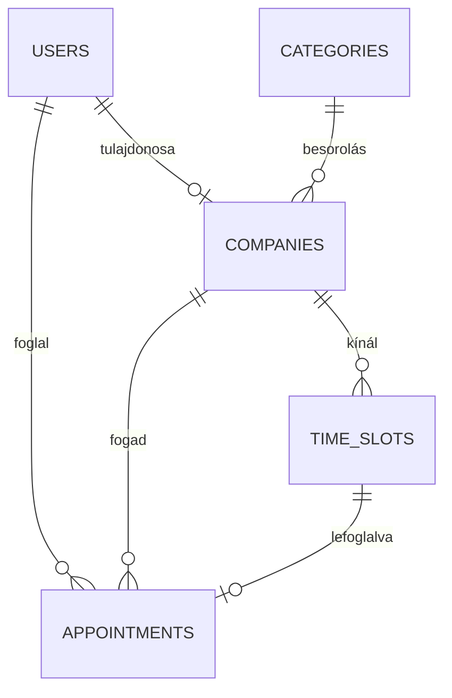

# Adatbázis Dokumentáció - Időpont Foglaló Rendszer

## 1. Bevezetés
Ez a dokumentum az „Időpont Foglaló” projekt adatbázis-struktúráját részletezi. A rendszer MySQL adatbázis-kezelőt használ, és úgy lett kialakítva, hogy hatékonyan kezelje a felhasználókat, vállalkozásokat és a hozzájuk kapcsolódó időpontfoglalásokat.

## 2. ER Diagram (Logikai Kapcsolatok)

## 3. Adattáblák Részletezése

### 3.1. `categories` (Kategóriák)
A vállalkozások tevékenységi köreit tárolja (pl. Fodrász, Orvos).

| Mezőnév | Típus | Leírás | Korlátozások |
| :--- | :--- | :--- | :--- |
| `id` | INT | Egyedi azonosító | PRIMARY KEY, AUTO_INCREMENT |
| `name` | VARCHAR(100) | A kategória neve | NOT NULL |
| `icon` | VARCHAR(10) | Megjelenítendő ikon (emoji) | NOT NULL |
| `created_at` | TIMESTAMP | Létrehozás időpontja | DEFAULT CURRENT_TIMESTAMP |

### 3.2. `users` (Felhasználók)
A rendszer összes felhasználóját tartalmazza (vásárlók és cégtulajdonosok).

| Mezőnév | Típus | Leírás | Korlátozások |
| :--- | :--- | :--- | :--- |
| `id` | INT | Egyedi azonosító | PRIMARY KEY, AUTO_INCREMENT |
| `name` | VARCHAR(100) | Teljes név | NOT NULL |
| `email` | VARCHAR(150) | Email cím (bejelentkezéshez) | UNIQUE, NOT NULL |
| `password_hash` | VARCHAR(255) | Titkosított jelszó | NOT NULL |
| `role` | ENUM | Szerepkör ('user', 'company') | DEFAULT 'user' |
| `created_at` | TIMESTAMP | Regisztráció időpontja | DEFAULT CURRENT_TIMESTAMP |

### 3.3. `companies` (Vállalkozások)
A szolgáltatást nyújtó cégek adatai. Kapcsolódik egy felhasználóhoz és egy kategóriához.

| Mezőnév | Típus | Leírás | Korlátozások |
| :--- | :--- | :--- | :--- |
| `id` | INT | Egyedi azonosító | PRIMARY KEY, AUTO_INCREMENT |
| `user_id` | INT | Tulajdonos azonosítója (users) | FOREIGN KEY, ON DELETE CASCADE |
| `name` | VARCHAR(150) | Vállalkozás neve | NOT NULL |
| `description` | TEXT | Rövid bemutatkozás | - |
| `category_id` | INT | Kategória azonosító (categories) | FOREIGN KEY |
| `address` | VARCHAR(255) | Cím | - |
| `phone` | VARCHAR(30) | Telefonszám | - |
| `created_at` | TIMESTAMP | Létrehozás időpontja | DEFAULT CURRENT_TIMESTAMP |

### 3.4. `time_slots` (Szabad időpontok)
A vállalkozások által meghirdetett időablakok.

| Mezőnév | Típus | Leírás | Korlátozások |
| :--- | :--- | :--- | :--- |
| `id` | INT | Egyedi azonosító | PRIMARY KEY, AUTO_INCREMENT |
| `company_id` | INT | Kapcsolódó cég azonosítója | FOREIGN KEY, ON DELETE CASCADE |
| `slot_date` | DATE | Az időpont dátuma | NOT NULL |
| `start_time` | TIME | Kezdési időpont | NOT NULL |
| `end_time` | TIME | Befejezési időpont | NOT NULL |
| `is_booked` | BOOLEAN | Foglaltsági állapot | DEFAULT FALSE |
| `created_at` | TIMESTAMP | Létrehozás időpontja | DEFAULT CURRENT_TIMESTAMP |

### 3.5. `appointments` (Foglalások)
A ténylegesen létrejött foglalások adatai.

| Mezőnév | Típus | Leírás | Korlátozások |
| :--- | :--- | :--- | :--- |
| `id` | INT | Egyedi azonosító | PRIMARY KEY, AUTO_INCREMENT |
| `user_id` | INT | Ügyfél azonosítója (users) | FOREIGN KEY, ON DELETE CASCADE |
| `company_id` | INT | Cég azonosítója (companies) | FOREIGN KEY, ON DELETE CASCADE |
| `slot_id` | INT | Lefoglalt időablak (time_slots) | FOREIGN KEY, ON DELETE CASCADE |
| `status` | ENUM | Állapot (pending, confirmed, cancelled)| DEFAULT 'pending' |
| `notes` | TEXT | Ügyfél megjegyzése | - |
| `created_at` | TIMESTAMP | Foglalás időpontja | DEFAULT CURRENT_TIMESTAMP |

## 4. Technikai Specifikációk
- **Karakterkódolás**: `utf8mb4_hungarian_ci` a magyar ékezetes karakterek helyes kezelése érdekében.
- **Integritási szabályok**: Kaszkádolt törlés (`ON DELETE CASCADE`) biztosítja, hogy ha egy felhasználó vagy cég törlésre kerül, a hozzá tartozó adatok is törlődjenek.
